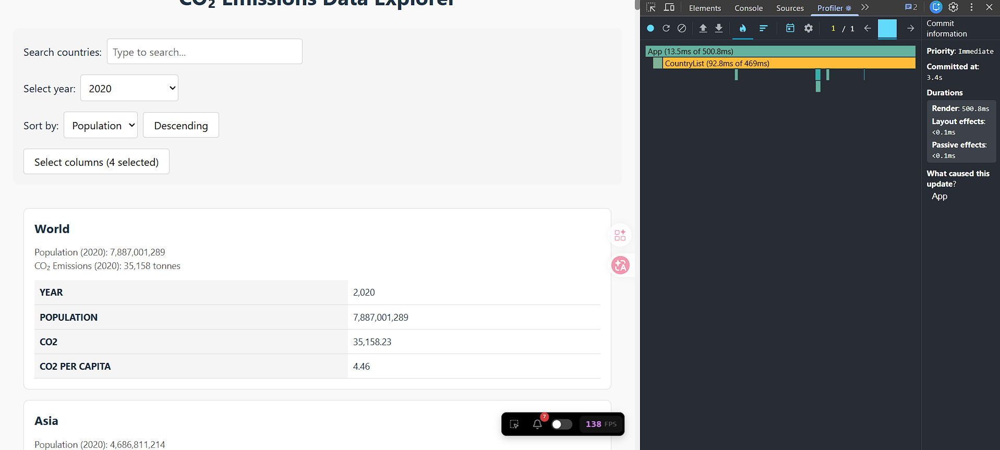
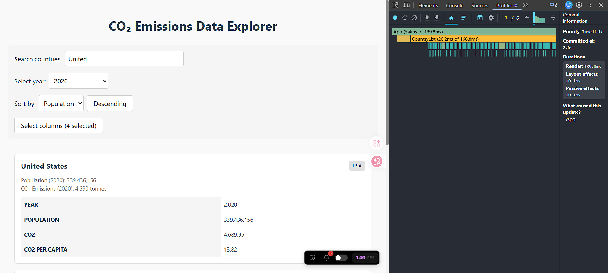
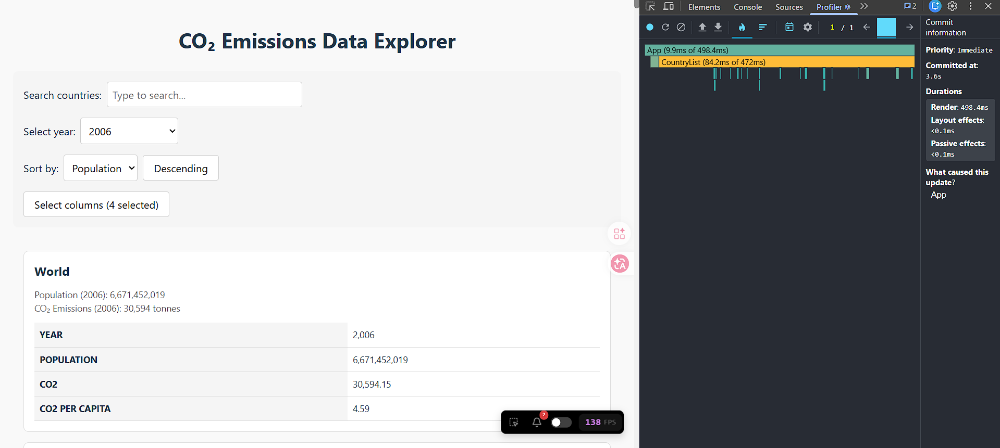
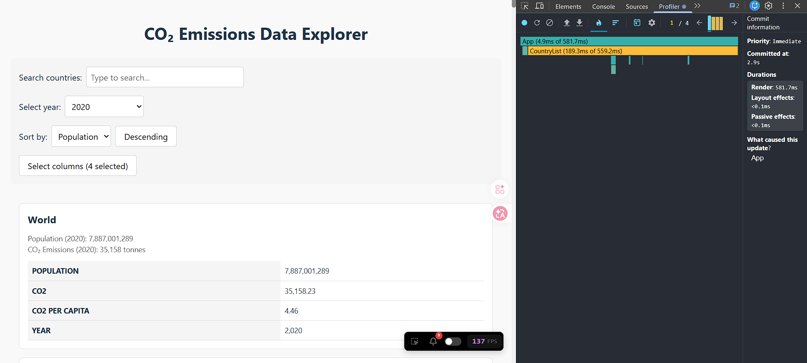
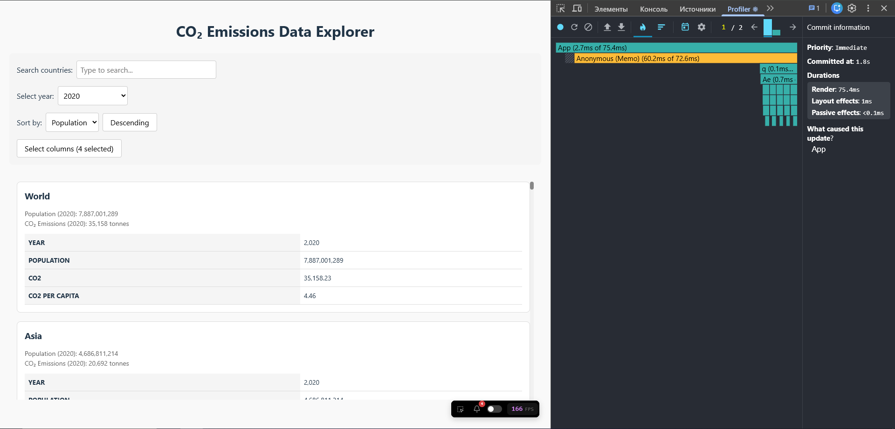
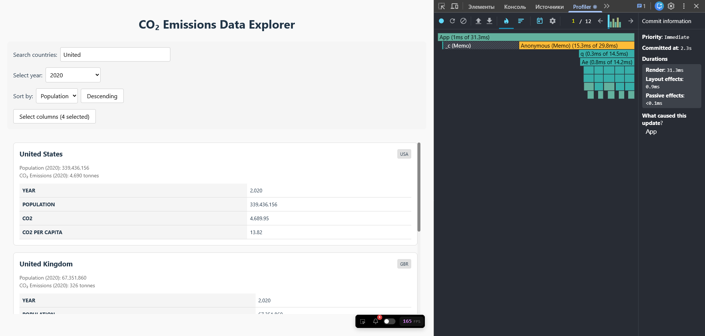
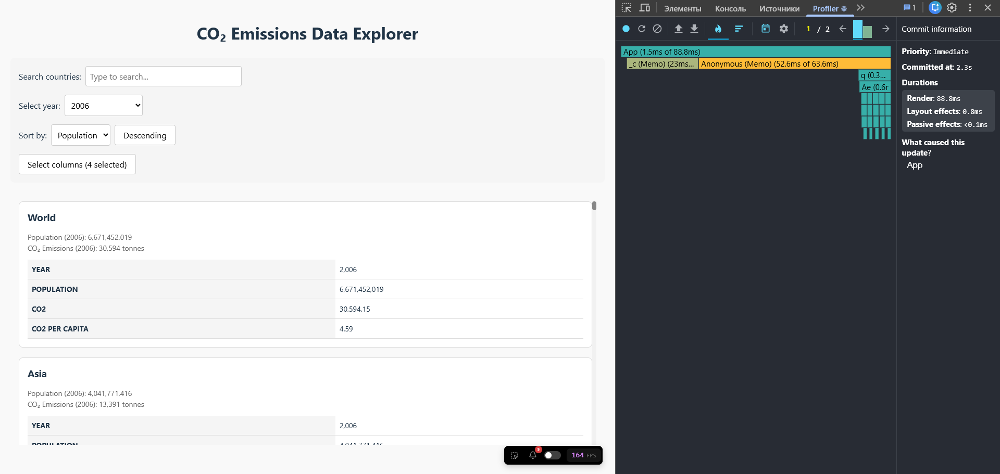
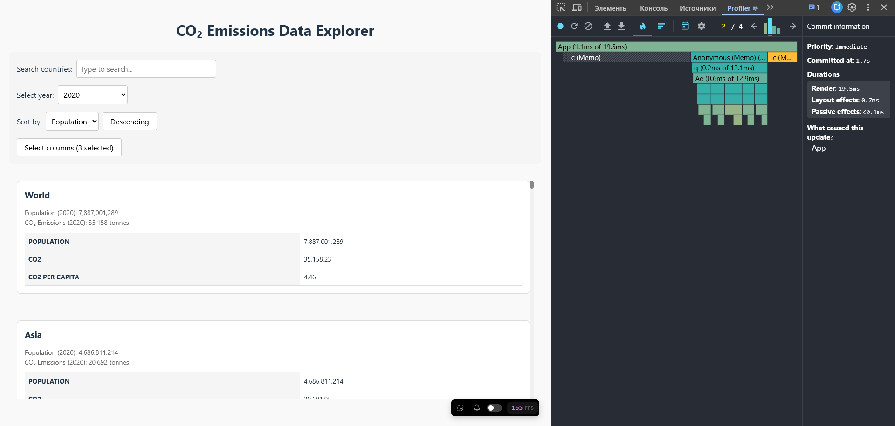

# Performance Optimization Report

> **Note regarding Commit duration:** According to the course moderator (SpaNb4) and React Profiler behavior, the pure Commit Duration metric is no longer explicitly provided. The moderator confirmed that we should focus primarily on Render duration (see [Discord message](https://discord.com/channels/794806036506607647/1333748258098380820/1515111545905090610)). Therefore, it is marked as N/A.

## Baseline Measurements

### Interaction A: Sort countries

- **Commit duration**: N/A
- **Render duration**: 500.8 ms
- **Screenshot**: 

### Interaction B: Search countries

- **Commit duration**: N/A
- **Render duration**: 189.8 ms
- **Screenshot**: 

### Interaction C: Change year

- **Commit duration**: N/A
- **Render duration**: 498.4 ms
- **Screenshot**: 

### Interaction D: Toggle column

- **Commit duration**: N/A
- **Render duration**: 581.7 ms
- **Screenshot**: 

## Optimized Measurements

### Interaction A: Sort countries

- **Commit duration**: N/A
- **Render duration**: 75.4 ms
- **Screenshot**: 

### Interaction B: Search countries

- **Commit duration**: N/A
- **Render duration**: 31.3 ms
- **Screenshot**: 

### Interaction C: Change year

- **Commit duration**: N/A
- **Render duration**: 88.8 ms
- **Screenshot**: 

### Interaction D: Toggle column

- **Commit duration**: N/A
- **Render duration**: 19.5 ms
- **Screenshot**: 

## Summary of Improvements

| Interaction      | Baseline (ms) | Optimized (ms) | Improvement |
| ---------------- | ------------- | -------------- | ----------- |
| Sort countries   | 500.8         | 75.4           | 84.9%       |
| Search countries | 189.8         | 31.3           | 83.5%       |
| Change year      | 498.4         | 88.8           | 82.2%       |
| Toggle column    | 581.7         | 19.5           | 96.6%       |
| **Average**      | **442.7**     | **53.8**       | **87.9%**   |